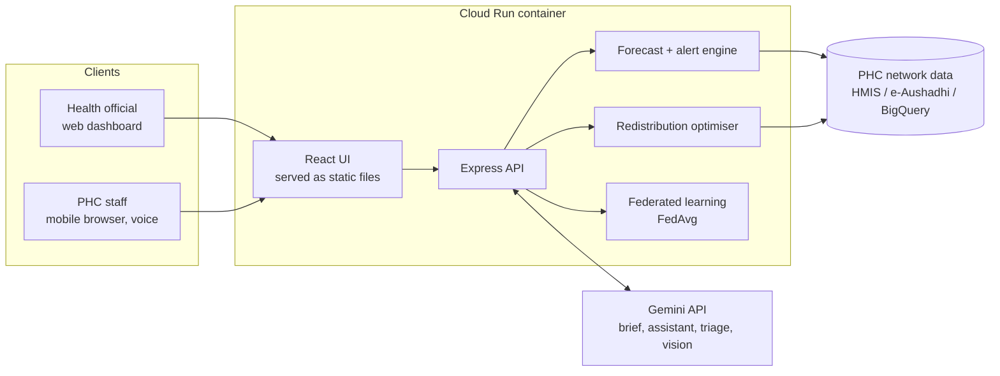

<div align="center">

# RapidAid

### Federated AI for India's PHC medicine, bed and staff supply chain

**See every Primary Health Centre in real time. Forecast stock-outs before they happen. Move medicines to where they are needed, automatically.**

[](https://rapidaid-784619610229.asia-south1.run.app)
[](https://ai.google.dev)
[](#the-problem)
[](#demo-video)

### [Open the live prototype](https://rapidaid-784619610229.asia-south1.run.app)


</div>

---

## Table of contents

- [The problem](#the-problem)
- [Our solution](#our-solution)
- [Try it in 2 minutes](#try-it-in-2-minutes)
- [Features](#features)
- [Where Google AI does the work](#where-google-ai-does-the-work)
- [How it maps to the judging criteria](#how-it-maps-to-the-judging-criteria)
- [Architecture](#architecture)
- [How the core algorithms work](#how-the-core-algorithms-work)
- [Scaling across India](#scaling-across-india)
- [Run locally](#run-locally)
- [Deploy to Cloud Run](#deploy-to-cloud-run)
- [API reference](#api-reference)
- [Project structure](#project-structure)
- [Honest notes](#honest-notes)
- [Roadmap](#roadmap)
- [Team](#team)

---

## The problem

Public healthcare across India depends on a vast network of Primary Health Centres (PHCs). Today, nobody can see across that network in real time:

- Medicine stock is tracked on paper registers and delayed reports, so **stock-outs are discovered when patients are already turned away**.
- One district can sit on months of surplus while a neighbouring district has zero paracetamol, ORS or anti-snake venom.
- During outbreaks (dengue, floods, heatwaves) demand spikes faster than the reporting cycle.
- States hold their own data and cannot easily pool it to build shared predictive models.

## Our solution

RapidAid gives health officials one live picture of medicines, beds and staff attendance across every PHC, then acts on it:

> **Monitor → Forecast → Warn → Redistribute → Learn together**

1. **Monitor** medicine stock, beds and staff at every PHC, rolled up by district, state and nation.
2. **Forecast** demand per district and medicine, and give early warning of stock-outs during health emergencies.
3. **Recommend and execute** cross-district (and cross-state) transfers, checking that stock arrives before the shortage.
4. **Learn together** through federated learning: states train locally and share only model weights, never records.

The original RapidAid emergency-response flow (SOS → triage → hospital referral) is kept as a module, now routed by live hospital capacity.

## Try it in 2 minutes

Open the [live demo](https://rapidaid-784619610229.asia-south1.run.app) and follow this path:

| Step | Where | What to do | What you'll see |
|---|---|---|---|
| 1 | **Command** | Look at the map and the stock-out alert count | 240 PHCs across 12 states, red bubbles where risk is highest |
| 2 | **Command** | Pick *Dengue surge* + *Bihar*, click **Declare scenario** | Alerts and forecasts recompute for Bihar |
| 3 | **Command** | Click **Generate brief** | Gemini writes a control-room briefing from the live data |
| 4 | **Forecast** | Choose *Paracetamol* | Demand forecast with confidence band, plus ranked early warnings |
| 5 | **Redistribute** | Click **Approve transfer** on a critical card | Stock moves between districts and the network updates |
| 6 | **Federated AI** | Click **Train** | FedAvg converges; 12 of 12 states improve versus training alone |
| 7 | **Emergency** | Run the chest-pain case, then **Dispatch ambulance** | Gemini triage, ranked hospitals by ICU and cath lab, animated route |
| 8 | **Assistant** | Switch to हिन्दी and ask about ORS | Answer in Hindi from live data; try the mic |

## Features

| | Feature | What it does |
|---|---|---|
| 🗺️ | **National command centre** | Live stock, beds, staff attendance and footfall across 240 PHCs, 48 districts and 12 states. Click a state to drill in. |
| 📦 | **PHC-level stock view** | Days of cover per medicine, sorted so the most fragile PHCs surface first. |
| 📷 | **Stock register scanning** | Photograph a paper register; Gemini vision extracts closing stock and updates the PHC. |
| 📈 | **Demand forecasting** | 14-day forecast per district and medicine with an 80% band, weekly seasonality and outbreak awareness. |
| 🚨 | **Early warnings** | Ranked list of projected stock-outs with the date each medicine runs out and the shortfall to restore 21 days of cover. |
| 🧪 | **Outbreak simulator** | Declare dengue, flood, heatwave or malaria in any state and watch forecasts, alerts and plans react end to end. |
| 🚚 | **Automated redistribution** | Matches surplus districts to shortage districts nearest-first, across state lines, and verifies arrival before stock-out. One tap dispatches. |
| 🤝 | **Federated learning** | Real FedAvg across 12 state models; adjustable rounds and privacy noise. |
| 🩺 | **Emergency module** | Gemini triage plus a referral engine that ranks hospitals by ICU beds, required services and distance. |
| 🗣️ | **Multilingual and voice** | English, Hindi, Tamil, Telugu, Kannada, Bengali and Marathi; speech input and read-aloud. |

<div align="center">


</div>

## Where Google AI does the work

| Google technology | Used for | Where |
|---|---|---|
| **Gemini API** (`gemini-2.5-flash`) | Situation briefs written from live alerts, forecasts and proposed transfers | Command tab |
| **Gemini API** | Multilingual assistant that answers only from live network data in 7 languages | Assistant tab |
| **Gemini API** (structured JSON) | Emergency triage: priority, care level, required services, first-aid steps | Emergency tab |
| **Gemini multimodal (vision)** | Reads photos of stock registers and shelves into structured stock counts | Stock tab |
| **Cloud Run** | Hosts the UI and API as one stateless container | Deployment |

Every AI feature has a rule-based fallback, so the product keeps working if the API is unreachable. The UI shows a **Gemini** badge when the model answered and **Offline engine** when a fallback did, so nothing is passed off as AI when it isn't.

Designed to plug into the wider Google stack when a ministry adopts it: Vertex AI for serving the forecast and running federated training in each state's own project, BigQuery for HMIS and e-Aushadhi feeds, Cloud Speech-to-Text, Text-to-Speech and Translation API for voice-first use, and Google Maps Platform for routing.

## How it maps to the judging criteria

| Criterion | How RapidAid addresses it |
|---|---|
| **Problem-solution fit (20%)** | Built for exactly the stated challenge: real-time medicine, bed and staff visibility across PHCs; demand forecasting; stock-out early warnings; automated cross-district redistribution; shared modelling across states. |
| **AI / technical execution (25%)** | Gemini does meaningful work in four places (briefs, assistant, triage, vision). Forecasting, alerting, redistribution and federated averaging are implemented and run end to end against a live API, verified by an automated endpoint checker. |
| **Depth and reach across India (20%)** | 12 states and 7 languages from day one. Federated design respects state data ownership. Regional-language voice and text for frontline workers. |
| **Impact potential (15%)** | India has tens of thousands of PHCs; even small reductions in stock-outs of ORS, antimalarials, anti-snake venom and anti-rabies vaccine affect large rural populations. |
| **Deployability and scalability (20%)** | One container on Cloud Run that scales to zero; data access sits behind a single module that can be pointed at HMIS or BigQuery; no per-state re-architecture. |

## Architecture



## How the core algorithms work

**Forecasting.** For each district and medicine the engine builds a 28-day demand history and fits a damped-trend model with weekly seasonal indices, then projects 14 days with a widening uncertainty band. When an outbreak is declared, the model adds a forward-looking uplift for that state and medicines, so warnings appear days before the shelves empty.

**Early warning.** Cumulative forecast demand is compared with on-hand stock to find the day each medicine runs out. Under 3 days is *critical*, under 7 *high*, under 14 *medium*.

**Redistribution.** For each medicine, districts with more than 28 days of projected cover are donors, keeping a 28-day reserve. Districts under 10 days are recipients, targeting 21 days. A greedy nearest-first match (great-circle distance) assigns quantities, estimates transit time, and flags whether the shipment lands before the projected stock-out. Approving a transfer moves stock between the districts' PHCs and recomputes every alert.

**Federated learning.** Each state trains a demand model on its own PHC data (features: rainfall anomaly, temperature anomaly, last-week demand, outbreak signal). Only the 5-number weight vector is sent for sample-weighted averaging, then returned. On the synthetic non-IID data in the demo, the federated model beats each state training alone in all 12 states and approaches the pooled-data ceiling that would require sharing raw records.

## Scaling across India

- **Add states without code changes:** a new state is another set of districts and PHCs in the data layer.
- **Data sovereignty:** federated training keeps records inside each state's environment.
- **Frontline usability:** low-bandwidth web app, regional languages, voice input.
- **Pilot path:** point `server/data.js` at a district's HMIS export or a BigQuery table, deploy the same container, and a state can pilot within weeks.

## Run locally

Requires Node 20+ and pnpm.

```bash
cd rapidaid
pnpm install
export GEMINI_API_KEY=your_key      # optional; get one at https://aistudio.google.com/apikey
pnpm run server                     # API on http://localhost:8080
pnpm run dev                        # UI on http://localhost:3000 (proxies /api)
```

Or a single process: `pnpm run build && pnpm start`, then open http://localhost:8080.

Verify frontend and backend are wired together:

```bash
node scripts/verify-endpoints.mjs                          # local
node scripts/verify-endpoints.mjs https://rapidaid-784619610229.asia-south1.run.app
```

## Deploy to Cloud Run

```bash
cd rapidaid
gcloud config set project YOUR_PROJECT_ID
gcloud services enable run.googleapis.com cloudbuild.googleapis.com artifactregistry.googleapis.com
gcloud run deploy rapidaid --source . --region asia-south1 --allow-unauthenticated \
  --min-instances 1 --max-instances 1 \
  --set-env-vars GEMINI_MODEL=gemini-2.5-flash,GEMINI_API_KEY=YOUR_KEY
node scripts/verify-endpoints.mjs YOUR_SERVICE_URL
```

For production, store the key in Secret Manager and use `--set-secrets GEMINI_API_KEY=gemini-key:latest`. `--max-instances 1` keeps the demo's in-memory state consistent for every viewer.

## API reference

| Method | Route | Purpose |
|---|---|---|
| GET | `/api/health` | Status and whether Gemini is enabled |
| GET | `/api/summary`, `/api/states`, `/api/map` | Network roll-ups and map data |
| GET | `/api/phcs`, `/api/phcs/:id` | PHC list (filter by state, status, search) and detail |
| GET | `/api/alerts` | Ranked stock-out early warnings |
| GET | `/api/forecast?med=&state=&district=` | History, forecast and band |
| GET | `/api/redistribution` | Recommended transfers |
| POST | `/api/redistribution/execute` | Dispatch a transfer |
| POST | `/api/scenario` | Declare or clear an outbreak scenario |
| GET | `/api/federated?rounds=&dp=` | Run federated averaging |
| POST | `/api/ai/brief` | Gemini situation brief |
| POST | `/api/ai/assistant` | Multilingual Q&A over live data |
| POST | `/api/ai/triage` | Emergency triage |
| POST | `/api/ai/scan` | Stock register photo to structured stock |
| POST | `/api/emergency/refer` | Rank hospitals for a case |

## Project structure

```
RapidAid/
├── README.md
├── docs/screenshots/
└── rapidaid/
    ├── server/          Express API
    │   ├── data.js        PHC network, hospitals, seeded data generator
    │   ├── engine.js      live simulation, forecasting, alerts, redistribution
    │   ├── federated.js   FedAvg across state models
    │   ├── gemini.js      Gemini client with graceful fallback
    │   └── index.js       routes and static hosting
    ├── src/             React + Tailwind + Framer Motion + Recharts
    │   ├── views/         Command, Stock, Forecast, Redistribute, Federated, Emergency, Assistant
    │   ├── components/    UI primitives, India map
    │   └── lib/           API client, i18n, formatting
    ├── scripts/verify-endpoints.mjs
    └── Dockerfile
```

## Honest notes

- **Data is synthetic but realistic.** It is seeded and shaped like HMIS and e-Aushadhi feeds. No real patient or facility data is used. `server/data.js` is the one module to replace with real feeds.
- **Federated learning runs on synthetic non-IID data.** The algorithm (FedAvg) is real and only weights are exchanged; the numbers are not a claim about real-world accuracy.
- **Demand model is a lightweight statistical model** running in the API. In production it would be trained and served on Vertex AI.
- **Not a medical device.** AI triage is decision support and a doctor confirms. In an emergency in India, call **112** or **108**.

## Roadmap

- [x] Real-time PHC stock, bed and staff visibility
- [x] Demand forecasting and stock-out early warnings
- [x] Automated cross-district redistribution with one-tap dispatch
- [x] Federated learning across states
- [x] Gemini briefs, multilingual assistant, triage and vision
- [x] Cloud Run deployment with endpoint verification
- [ ] Connect to real HMIS / e-Aushadhi feeds via BigQuery
- [ ] Serve forecasts and run federated training on Vertex AI
- [ ] Cloud Speech-to-Text and Translation API for full voice-first use
- [ ] Google Maps Platform routing for live transit times
- [ ] ABDM / ABHA integration and role-based access per state
- [ ] Offline-first PHC data entry for low-connectivity areas

## Team

| Name | Role |
|---|---|
| Tulip Sahu | Frontend & UI/UX Developer |
| Vratika Sahota | AI & Backend Developer |
| Sreeja M | Healthcare & System Integration Lead |

---


<div align="center">

**No PHC should run out of medicine when it matters.**

[Live demo](https://rapidaid-784619610229.asia-south1.run.app) · Built for the Build with AI: Code for Communities hackathon

</div>
